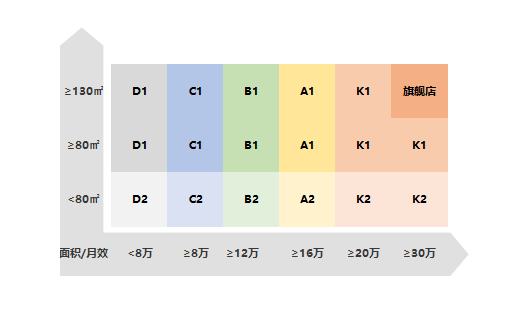

## SKU大表

## 售罄跟进

### SKU宽度

等于物料代码的不重复计数

### 进货售罄

=SUM([销售吊牌金额])/SUM([进货金额])

### 目标售罄

=SUM([销售吊牌金额目标])/SUM([订货金额])

### 销售折扣

=SUM([销售金额])/SUM([销售吊牌金额])	

### 订货吊牌金额

=进货吊牌金额+现货库存

### 订货售罄

=SUM([销售吊牌金额])/SUM([订货金额])

### 是否参与同比测算

1. 周号为“整体”或者小于等于当前周号

2. 数据类型不是排产数据

3. 大类中不为空

   此时参加同比测算。

   #### 判断公式：

IF(V2="","N",IF(C2<>"排产",IF(OR(D2="整体",D2<="B13"),"Y","N"),"N"))

## 客户动销统计

### 宽度满足率

= 平均服装库存 SKU个数 / 平均标准服装陈列宽度 

### 动销率

= 平均服装销售sku个数 / 平均服装库存SKU个数 

###  平均标准服装陈列宽度 

陈列宽度指店铺陈列商品的SKU范围

这里的标准只是特别说明，并没有与之对应的非标准这个概念。

## 销售体系简报

### 月效

=店铺新开/整改次月至期末累计流水÷期间累计流水月数

## 同店同比

### 上市旬

指客户有销售的那个时间点

### 店铺层级

## 加单产品回顾与规划

1. 现货库存量为空，但售罄率并不全是100%？
2. 加单次数大于1，那加单总量是几次加单的和？
3. 加单后产销率是指？
4. 一次加单时售罄速度为什么是百分比？
5. 一次加单时间段是指什么？